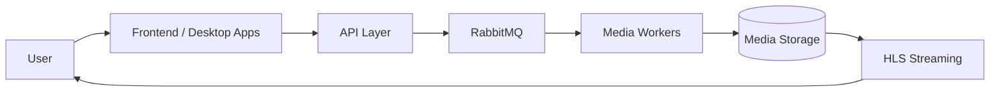

<!-- HERO -->
<div align="center">

<p align="center">
  
</p>

<p align="center">
  
  
</p>

<h3>
  Modular streaming, media processing, and automation ecosystem.
</h3>

<p align="center">
  BudgetFlix is an early-stage platform focused on scalable media workflows,
  queue-driven processing, streaming infrastructure, and self-hosted tooling.
</p>

<br>

</div>


# Tech Stack

## Backend & Processing

<p>


</p>

## Frontend

<p>


</p>

## Infrastructure

<p>


</p>

---

# Overview

BudgetFlix is a modular media ecosystem built around lightweight services, isolated workers, and queue-based communication.

The platform currently focuses on:

- media uploads
- distributed processing
- HLS video generation
- streaming workflows
- infrastructure orchestration
- automation tooling

The architecture is intentionally designed so every service can evolve independently while still fitting into a larger scalable system.

---

# Ecosystem Architecture



---

# Repositories

| Repository | Description |
| --- | --- |
| [`frontend`](https://github.com/BudgetFlix/frontend) | Next.js streaming frontend monorepo |
| [`api`](https://github.com/BudgetFlix/api) | Spring Boot backend and upload orchestration |
| [`worker`](https://github.com/BudgetFlix/worker) | Go-based FFmpeg media processing worker |
| [`media-uploader`](https://github.com/BudgetFlix/media-uploader) | Tauri desktop uploader |
| [`infra`](https://github.com/BudgetFlix/infra) | Docker infrastructure and orchestration |

---

# Repository Roles

## [`frontend`](https://github.com/BudgetFlix/frontend)

<p>


</p>

Streaming frontend foundation focused on:

- movie browsing
- HLS playback
- reusable UI architecture
- scalable frontend packages

---

## [`api`](https://github.com/BudgetFlix/api)

<p>


</p>

Backend orchestration layer responsible for:

- upload job creation
- RabbitMQ publishing
- movie metadata
- stream path lookup
- processing state management

---

## [`worker`](https://github.com/BudgetFlix/worker)

<p>


</p>

Distributed media processing worker with:

- FFmpeg HLS pipelines
- filesystem job lifecycle
- queue acknowledgement handling
- graceful shutdown support

---

## [`media-uploader`](https://github.com/BudgetFlix/media-uploader)

<p>


</p>

Desktop-first upload tool featuring:

- local media uploads
- SFTP transfer flow
- API integration
- native desktop runtime

---

## [`infra`](https://github.com/BudgetFlix/infra)

<p>


</p>

Infrastructure repository containing:

- Docker Compose environments
- shared networking
- queue infrastructure
- deployment workflow foundations

---

# Processing Flow


---

# Design Principles

BudgetFlix is being built around a few core ideas:

- small isolated services
- queue-driven workflows
- reproducible local infrastructure
- practical engineering over overengineering
- scalable architecture without early complexity
- self-hosted friendly deployments
- incremental development

The goal is to build systems that remain understandable as the platform grows.

---

# Roadmap

- [x] RabbitMQ messaging
- [x] Dockerized local infrastructure
- [x] Initial upload pipeline
- [x] HLS media processing
- [x] Frontend monorepo foundation
- [ ] Streaming authentication
- [ ] Monitoring and metrics
- [ ] Distributed worker scaling
- [ ] Upload dashboards
- [ ] Search and metadata systems
- [ ] Multi-environment deployments
- [ ] Kubernetes support
- [ ] Automated media workflows

---

# Development Status

BudgetFlix is currently in an early but functional foundation stage.

Core architecture pieces already exist:

- frontend
- backend API
- upload tooling
- queue infrastructure
- media processing pipeline

The current focus is improving integration between services while expanding the streaming and automation workflow.

---

# Contributing

Contributions, ideas, and feedback are welcome.

```bash
git checkout -b feature/my-feature
git commit -m "Add my feature"
git push origin feature/my-feature
```

Then open a Pull Request.

---

# Philosophy

> Build the pipeline first.  
> Make it reliable.  
> Scale it later.

---

<div align="center">

Built by <b>PeterKokenyessy</b>

</div>
